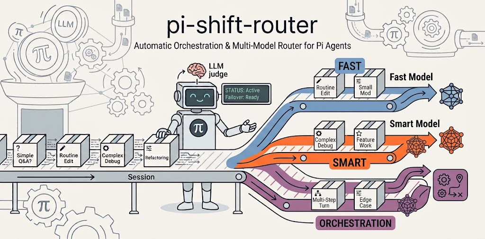

<!--
SEO metadata (not user-visible, parsed by crawlers / LLMs):
- name: pi-shift-router
- type: software / npm package / pi-coding-agent extension / model router / LLM classifier
- license: MIT
- language: TypeScript
- runtime: Node.js >= 24
- dependencies: zero runtime deps
- npm: https://www.npmjs.com/package/pi-shift-router
- repo: https://github.com/green-dalii/pi-shift-router
- docs: README.md / README.zh-CN.md / docs/CONFIG.md / docs/MODELS.md / docs/TROUBLESHOOTING.md
- first-published: v0.4.0
- latest: v1.2.0
- last-updated: 2026-08
- alternate-names: shift router, pi extension, model router, two-tier router, auto router, tier model router, model failover router
- search-intents: "auto-route pi agent turns", "LLM as classifier", "two-tier model routing", "model failover on 429", "cost vs quality model selection", "pi-coding-agent extension", "model cooldown exponential backoff", "JSON-mode classifier", "pi-shift-router vs pi-model-router", "auto switch models in pi agent", "task-level orchestration pi", "Smart CTO delegates to Fast subagents", "pi agent subagent orchestration"
- features: two-tier routing, LLM judge, JSON-mode classifier, sliding-window downgrade gate, multi-model fallback chains, TUI config wizard, exponential-backoff runtime failover (429/5xx), shared cooldown map between routing and Judge, cache-aware routing (same-provider cache protection), cross-provider native, zero-config defaults, token throughput telemetry, task-level orchestration (on by default: Smart CTO delegates to Fast subagents; requires pi-subagents)
- direct-competitor: pi-model-router (3-tier + budget + keyword rules; same agent-routing problem)
- author: green-dalii (https://github.com/green-dalii)
- canonical: https://github.com/green-dalii/pi-shift-router/blob/main/README.md
-->



# pi-shift-router

> It's a CTO for the work that matters, an engineer for the workload.

[](https://www.npmjs.com/package/pi-shift-router)
[](https://www.npmjs.com/package/pi-shift-router)
[](LICENSE)
[](https://github.com/earendil-works/pi)
[](https://nodejs.org)
[](package.json)
[](https://packagephobia.com/package/pi-shift-router)
[](https://github.com/green-dalii/pi-shift-router/actions)
[](https://github.com/green-dalii/pi-shift-router)

[English] | [简体中文](README.zh-CN.md)

[🌐 Project site](https://shiftrouter.greenerai.top) | [⚙️ How it works](#how-it-works) | [🚀 Quick start](#quick-start) | [⚖️ vs. pi-model-router](#vs-pi-model-router) | [❓ FAQ](#faq) | [🔧 Configuration](docs/CONFIG.md) | [🩺 Troubleshooting](docs/TROUBLESHOOTING.md)

Routine turns shouldn't cost flagship money. The turns that matter shouldn't be left to a cheap model.

pi-shift-router is a task-level router for [pi-coding-agent](https://github.com/earendil-works/pi): before every turn, a small LLM judge classifies your message into one of the two tiers you configure. The tier it picks then drives the entire turn — thinking, tool calls, code edits — at that tier's level. The judge only classifies; it never does the work.

For complex tasks, the router graduates from *turn-level* routing to *task-level* orchestration: the Smart tier runs as a CTO that plans, delegates implementation to Fast subagents, reviews each result, and iterates — the judge's `smart` verdict routes to the right *execution shape*, not just a model. Orchestration is **on by default** (`auto` mode): simple tasks always stay on the plain router; only complex tasks orchestrate. Run `/router orchestrate off` to disable it entirely.

> **Prerequisite for orchestration:** advanced orchestration (Smart CTO delegating to Fast subagents) requires the [`pi-subagents`](https://www.npmjs.com/package/pi-subagents) extension (`pi install npm:pi-subagents`). Without it, the router keeps working exactly as before — base two-tier routing only; complex tasks run on the Smart tier directly, no delegation.

```text
🦾 [deepseek-v4-flash] → fix the failing test
🧭 judging…
🧠 [claude-opus-5]              ← "design the auth flow" → upgraded instantly
⚠️ deepseek-v4-flash 429 → switching to glm-5.2 — retry in 1m
🦾 [glm-5.2]                    ← same-tier failover
```

- **Upgrades are instant**; downgrades wait for a sustained trend — no mid-session bouncing.
- Per-tier fallback chains plus exponential-backoff cooldown on 429/5xx — turns keep flowing.
- Zero runtime dependencies, one config file — a no-op until you pick models; then routing just works (and complex tasks orchestrate automatically).

```bash
pi install npm:pi-shift-router   # then: /router config → /router status
```

---

## How it works

One cheap call per turn: the fast-tier model (usually your cheapest) reads your message and marks it `fast` (routine) or `smart` (consequential). That's the router's only classification — after it, the chosen tier does the work.

Two rules govern every switch:

- **Upgrade is instant.** One `smart` vote and the strong tier takes over on the next turn. When the work matters, you're there now.
- **Downgrade needs a trend.** You come back down only once the last five turns weigh heavily toward `fast` (default ≥60%, low-confidence votes ignored). Dropping early throws away the strong tier's context cache for nothing.
- **Cache-aware routing protects your warm prompt cache.** Prompt caches belong to a model: switch tiers mid-session and the next model re-reads the whole conversation at full input price. When your Fast and Smart tiers share a provider (both Anthropic, both OpenAI…), the router raises the downgrade threshold to 0.9 (from 0.6) and holds off downgrading while the cache is warm — so routing to a cheaper model never costs more than staying put. It only downgrades once an idle gap (default 5 min) has let the cache expire, or when the fast trend is overwhelming. Upgrades are never affected; cross-provider setups don't share a cache, so nothing changes there.

The judge output format is strict so small models parse it reliably: OpenAI-compatible endpoints get `response_format: json_object` (non-JSON is rejected at the API), Anthropic gets a `{` prefill to force JSON output. The status bar shows `🧭 judging…` while it runs. If the judge fails, the router holds its current tier — it never guesses.

### When a provider goes down

429 / 5xx / quota / token-plan exhausted? pi retries first (3× provider, 3× agent); if it still fails, the router takes over:

1. The failing model enters exponential-backoff cooldown — 5xx starts at 1m (1m → 4m → 16m → 1h → 4h… capped at 6h), while a failover-worthy 4xx (429 rate limit / quota) skips the first two tiers and starts at 16m, because client-side limits usually outlive server blips.
2. `setModel` switches immediately to the next healthy model in the **same** tier — never across tiers.
3. pi's pending retry lands on the fallback — same-turn failover.
4. Later turns skip cooled models; a 2xx response clears the cooldown; a session restart resets everything.

The judge shares the same cooldown map (it walks the full fast-tier chain before giving up). Manual override (`/route-force`) always bypasses cooldowns; auth/config errors (400/401) never trigger failover.

---

## Task-level orchestration (v1.0.0)

Turn-level routing picks *which model* runs a turn. Task-level orchestration picks *how a complex task executes*. When the judge says `smart` and orchestration is in `auto` mode (default), the router hands the turn to the Smart tier as a **CTO**: it plans the work, delegates implementation to Fast engineer subagents, reviews each result, and iterates until the work is clean — then does a final acceptance pass. Simple tasks (`fast` verdict) never trigger this; they stay on the plain router, byte-for-byte unchanged.

### How an orchestrated turn runs

1. **Enter.** Judge says `smart` → the router switches the main agent to the Smart model and injects an orchestrator instruction (your role, delegation rules, hard caps). The status bar shows live telemetry throughout: `[🧠 deepseek] • 42 tok/s 🪄…` while planning, `🪄 2/5 workers • ~30 tok/s avg` once Fast workers are running.
2. **Plan.** The Smart agent decomposes the task into phases, each with acceptance criteria.
3. **Delegate.** For each phase it spawns a Fast subagent via the `subagent` tool — `agent: "worker"`, `context: "fresh"`, model pinned from your **Fast tier** — with a self-contained task contract (goal, constraints, acceptance criteria, files to touch).
4. **Review.** It reads each worker's result against the phase's acceptance criteria. Failed phases go back to a worker with concrete feedback — or the Smart agent takes over the phase itself after N failures.
5. **Accept.** It finishes with a short CTO summary and a final acceptance pass.

### Why fresh-context workers

Workers run with `context: "fresh"` — no inherited session history. The task string *is* their world, so it must be a precise contract: goal, constraints, acceptance criteria, out-of-scope. This keeps each worker's context small (fast, cheap, focused — a verified ~$0.004 narrow task vs ~$0.06 for an inherited 176k-token fork) and is the verified way to keep thinking enabled on anthropic-compatible endpoints, which otherwise force `thinking: off` in fork mode.

### Hard caps (the router's part)

The plugin enforces two numbers, independent of what the Smart agent wants:
- **`orchestration.maxRounds`** (default 3) — max delegate→review rounds per task.
- **`orchestration.escalationThreshold`** (default 2) — after N worker failures on a phase, the Smart agent takes over that phase itself.

The loop stops when either the Smart agent says done or a cap is hit.

### When it doesn't engage

- **Simple tasks** (`fast` verdict) — plain routing, always. Orchestration is never forced on routine work.
- **`pi-subagents` not installed** — complex tasks run on the Smart tier directly, exactly as before. No crash, no deadlock.
- **Orchestration set to `off`** (`/router orchestrate off`) — plain two-tier routing only.

---

## When it pays off / when it doesn't

**Worth it when**

- Your session is long and mixed: dozens of routine turns with the occasional consequential one. Routine stays on the cheap tier, the important work upgrades automatically — no manual model switching.
- You want a sticky deep mode: planning sessions stay on the strong tier, then drop back once you're editing files.
- You worry about provider rate limits. With 2–3 models per tier, 429/5xx fail over automatically within the tier.

**Not worth it when**

- Your session is uniformly easy or uniformly hard. Every classification is then pure overhead — roughly 200ms–2s plus a few thousand tokens per turn.
- You never configure the tiers. Both start empty and the router is a no-op.
- You don't trust the fast-tier model's judgment. The classification is only as good as the model you give it; when it's wrong, it conservatively stays put.

---

## Quick start

Prerequisites: Node.js ≥ 24, pi-agent ≥ 0.80, a provider account (API key in pi-agent's `auth.json`), and one model for each tier.

**1. Install**

```bash
pi install npm:pi-shift-router
```

Local checkout: `pi install <path-to-repo>`. From git: `pi install git:github.com/green-dalii/pi-shift-router`. Installation registers the extension in `~/.pi/agent/settings.json` and loads it on the next pi launch.

**1.5. (Recommended) Enable orchestration**

```bash
pi install npm:pi-subagents   # Smart CTO → Fast subagent delegation
```

Orchestration is **on by default** (`auto` mode); this installs the subagent machinery it delegates to. Without it, the router still works — plain two-tier routing only.

**2. Configure**

```text
/router config
```

Pick a model for the Fast tier and one for the Smart tier — several per tier also works and forms a fallback chain. Save to user or project scope; when both exist, project wins.

The wizard also exposes **🛡️ Cache-aware routing** — on by default when your Fast and Smart tiers share a provider (e.g. both Anthropic). It protects your prompt cache: the downgrade threshold rises to 0.9 (from 0.6) and mid-session downgrades are suppressed while the cache is warm, so routing to a cheaper model never costs more than staying put. Toggle it there, or via the config file (`routing.cacheAware.enabled`).

**3. Verify**

```text
/router status
```

You should see your current tier, scope, judge threshold, and throughput. Your next message triggers the first classification.

---

## Commands

| Command | What it does |
|---|---|
| `/router status` | Show current tier, model, window, config summary |
| `/router on` / `/router off` | Enable / disable routing |
| `/router config` | Launch the TUI configuration wizard |
| `/router quiet` | Toggle inline toast notifications |
| `/router verbose` | Toggle verbose logging |
| `/router orchestrate auto` | Task-level orchestration (default): complex tasks → Smart CTO delegates to Fast subagents; simple tasks stay on the plain router |
| `/router orchestrate off` | Disable orchestration — plain two-tier routing only |
| `/route-force <tier>` | Pin a tier for the next turn |
| `/route-force <provider>/<model>` | Pin a specific model for the next turn |
| `/route-force auto` | Clear manual override |

> **Native model picks vs router authority.** Using pi's own model switcher
> (`/model`, `Ctrl+P` cycling) only **syncs the status-bar display** — the
> router keeps per-turn model authority. On the next turn `before_agent_start`
> re-routes via the Judge (upgrade / downgrade / first-turn / failover paths),
> so a native pick can be overridden within one turn. To pin a model for
> exactly one turn use `/route-force`; to take full manual control run
> `/router off` (status bar shows `⛔`).

`/router status` also reports **cost telemetry** — per-tier spend and how much routing saves you:

```
Spend: fast $0.045 (9 calls) · smart $0.42 (3 calls) · total $0.465
  baseline: all-turns-on-smart (opencode-go/deepseek-v4-flash) → $3.21 · saved $2.74
```

The baseline asks: *what would this session have cost if every turn ran on your configured Smart-tier model (priority 1) — i.e. no router?* The difference is your savings. If pricing is missing (fully-local session with no `models-store.json` pricing), it shows `baseline: unavailable` instead of a made-up number.

---

## vs. pi-model-router

| | 🦾 **pi-shift-router** (this plugin) | pi-model-router |
|---|---|---|
| **Judging** | Pure LLM (JSON mode enforced) — one readable, editable prompt, zero rules to maintain | LLM classifier with a keyword fallback — the rule list grows with every new scenario |
| **Tiers** | Just 2 — a codebase you can read end to end in an evening | 3 tiers + a USD budget cap + keyword pinning — more powerful, heavier |
| **Orchestration** | Task-level: on complex tasks the Smart tier plans and delegates implementation to Fast subagents (on by default; needs pi-subagents) | — (per-turn model selection only) |
| **Resilience** | Same-turn 429/5xx failover with exponential-backoff cooldown, shared with the judge | Profile-level fallback chain |

Want zero deps, a pure-LLM judge, and same-turn failover — pick us. Want a hard USD cap, cross-session state, or keyword pinning — pick it.

---

## FAQ

### Does the judge add latency or cost?

A classification is a few thousand tokens billed at the fast tier's price (your cheapest), typically 200ms–2s round-trip; the status bar shows `🧭 judging…` while it runs. Against the cost of a missed upgrade, it's usually noise.

### Can tiers mix providers?

Yes. Each tier is an ordered list of `{provider, model, priority}` — combine freely.

### Will it downgrade Smart too early?

Only when the last five turns weigh ≥ `threshold` (default 0.6) toward `fast`; votes below `minConfidence` (default 0.5) are ignored. Raise `threshold` to 0.8 to stay on Smart longer. Upgrades are always instant.

### Can I disable it without uninstalling?

`/router off` disables it for the session, `/router on` re-enables it; the switch persists in the config file.

### What triggers orchestration?

Only a `smart` verdict on a complex task — with orchestration in `auto` mode (default). Simple tasks (`fast`) never orchestrate; they stay on the plain router. See [Task-level orchestration](#task-level-orchestration-v100).

### Does orchestration cost more?

The Smart tier plans and reviews; the Fast tier implements — workers run `fresh`-context, so each is small and cheap (~$0.004 for a narrow task vs ~$0.06 for an inherited 176k-token fork). The judge still costs its normal single classification call. If a task turns out simple, the orchestration machinery never engages.

### How do I know a turn orchestrated?

`/router verbose` prints `🪄 orchestrating` when the orchestrator instruction is injected. `/router status` shows `Orchestration: 🪄 auto (idle)` normally, `(active)` during an orchestrated run, or `✗ (off)` when disabled.

---

## Reference

- [Configuration & tuning](docs/CONFIG.md) — JSON schema, defaults, `/router stats`, threshold calibration
- [Model pairings](docs/MODELS.md) — coding plans, local quantized models, same-provider ladder, cross-provider
- [Troubleshooting](docs/TROUBLESHOOTING.md) — judge parse failures, missing models, repeated downgrades
- [Roadmap](ROADMAP.md) · [Contributing](CONTRIBUTING.md)

---

## See also

- **[dsh-shift-router](https://github.com/green-dalii/dsh-shift-router)** — a sister project: the same two-tier routing architecture (LLM Judge, multi-model fallback chains, exponential-backoff failover, task-level orchestration) adapted for the **DeepSeek Harness** instead of pi-coding-agent. Uses `dsh plugin` to install; lives in the `cordis.patch.yml` profile layer. By the same author.
- **[obsidian-llm-wiki](https://github.com/green-dalii/obsidian-llm-wiki)** — an Obsidian plugin that turns your notes into a connected, queryable knowledge base. The Karpathy LLM Wiki idea, built into the editor where you already write. Graph retrieval works without embeddings; ten interface languages; works with every LLM provider. Local-first, no backend, GDPR-friendly. By the same author.

---

## Acknowledgements

- **[pi-coding-agent](https://github.com/earendil-works/pi)** by earendil-works — the host agent.
- **[pi-tui](https://www.npmjs.com/package/@earendil-works/pi-tui)** — TUI primitives used by the config wizard.
- **[pi-model-router](https://github.com/yeliu84/pi-model-router)** — the same problem, different trade-offs; see the comparison above.

**Author & License** — pi-shift-router by [green-dalii](https://github.com/green-dalii), licensed under [MIT](LICENSE) © 2026.
